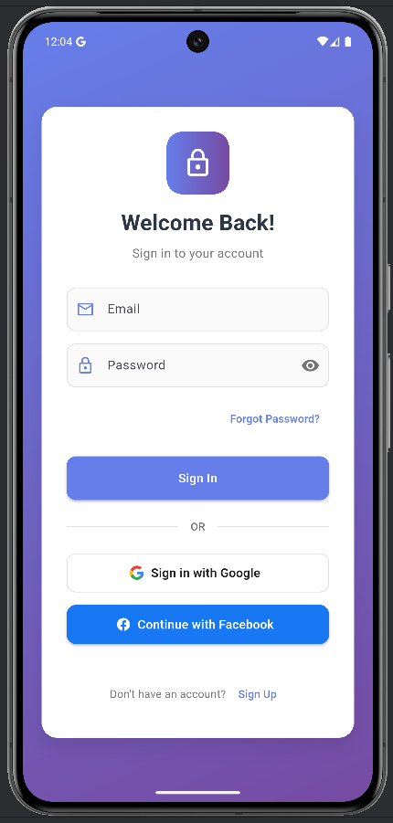
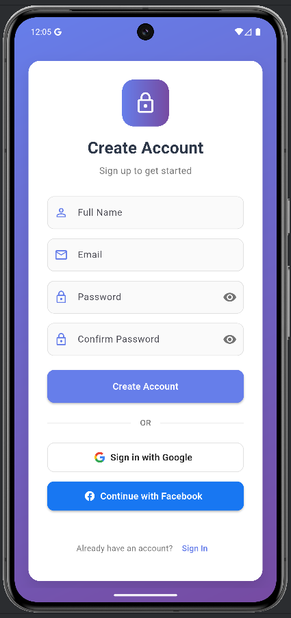

# Flutter Login/Signup UI Design

A beautiful and modern Flutter login/signup UI design showcase with Material 3 design principles, smooth animations, and responsive layout.

## Screenshots

### Login Screen


### Signup Screen


## Features

- **Material 3 Design**: Modern UI following Google's latest design guidelines
- **Smooth Animations**: Beautiful transitions and micro-interactions
- **Responsive Layout**: Adapts to different screen sizes
- **Dark/Light Theme Support**: Automatic theme switching
- **Form Validation**: Input field validation with error states
- **Custom Gradient Background**: Eye-catching gradient design
- **Social Login UI**: Beautiful Google and Facebook login buttons (UI only)
- **Typography**: Clean and readable text hierarchy
- **Accessibility**: Screen reader friendly

## Getting Started

### Prerequisites
- Flutter SDK (latest stable version)
- Dart SDK
- Android Studio / VS Code
- Android/iOS device or emulator

### Installation

1. Clone the repository:
```bash
git clone <repository-url>
cd day_03_login_signup
```

2. Install dependencies:
```bash
flutter pub get
```

3. Run the app:
```bash
flutter run
```

## Project Structure

```
lib/
└── main.dart          # Main application file with UI components
android/               # Android platform files
ios/                   # iOS platform files
screenshots/           # App screenshots
```

## Design Showcase

This project demonstrates:

- **Clean Architecture**: Well-organized code structure
- **Custom Widgets**: Reusable UI components
- **Animation Implementation**: Smooth page transitions
- **Form Handling**: Text field management and validation
- **Responsive Design**: Mobile-first approach
- **Color Schemes**: Beautiful gradient and color combinations

## Technologies Used

- **Flutter**: UI framework
- **Dart**: Programming language
- **Material 3**: Design system
- **Custom Animations**: Flutter animation APIs

## Notes

- This is a **design-only** application
- No actual authentication functionality
- Perfect for UI/UX inspiration
- Ready for integration with backend services
- Optimized for mobile devices

## Contributing

Feel free to contribute to this project by:
- Reporting bugs
- Suggesting new features
- Improving the UI/UX
- Adding animations

## License

This project is open source and available under the [MIT License](LICENSE).

---

**Made with love using Flutter**

*Perfect for learning Flutter UI development and Material 3 design implementation.*